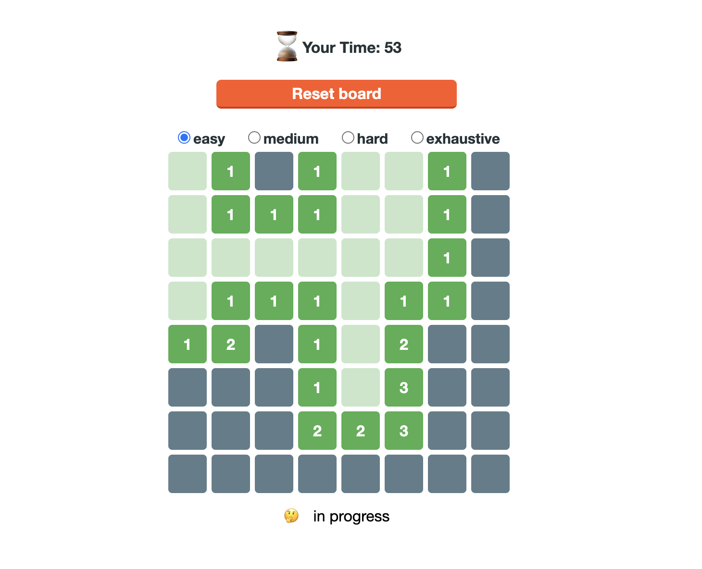

# React Minigames

Funny minigames with vanilla React SPA.
You can learn basic but modern react coding by building these games by yourself.

## Minesweeper

Minesweeper game is good teaching material for those who completed [React Tutorial](https://ja.react.dev/learn).  
Minesweeper coding includes some elements suitable for learing basics of React v18 features.  
- **Design And Planning**  
    You need to define relatively many states but not quite a lot.
- **Interactivity**  
    You need to design interaction to various types of user action in proper way.  
- **State Management**  
    You need to management some complex state updates.  
- **Usage of Modern React Hooks**  
    Some game state should be shared thoughout Components of App - `useContext() and useReducer()`.  
    Elapsed Time of game, score of the game, should be tracked by using `useRef()` hook.  

### Usage

[Let's Play](https://navifolio.github.io/react-minigames/)

